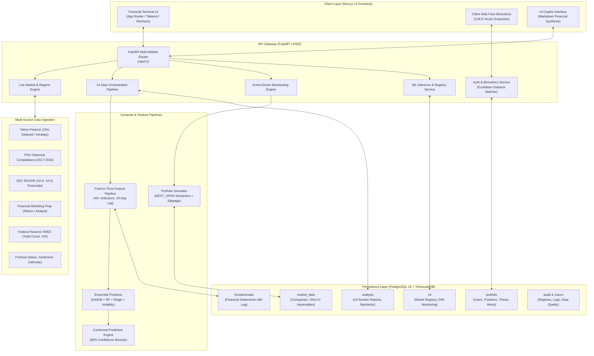
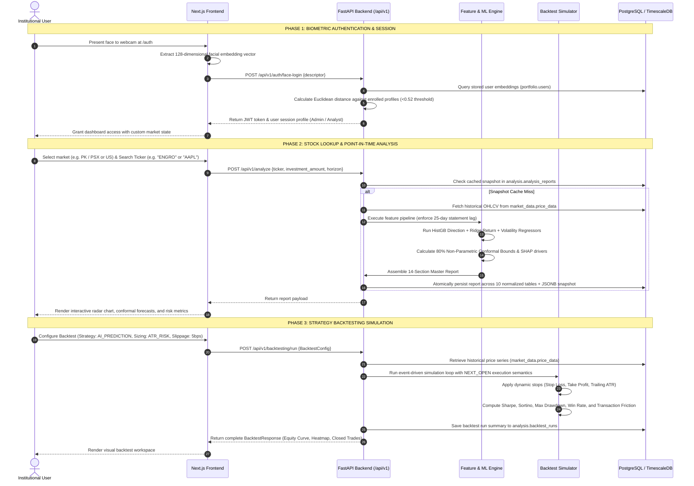
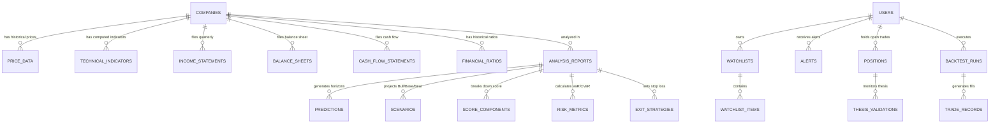
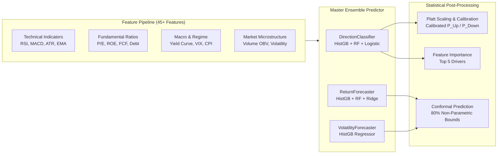

# StockSense AI — Comprehensive Project Demo & Architectural Master Guide

Welcome to the definitive architectural, functional, and engineering documentation for **StockSense AI**. This guide provides an exhaustive breakdown of the entire platform: end-to-end data flow, technology stack rationales, database schemas and persistence patterns, an in-depth function-by-function manual for the Backtesting Studio, machine learning model mechanics, and detailed explanations of every user-facing feature.

---

## Table of Contents
1. [Actual Flow of the System & Application Architecture](#1-actual-flow-of-the-system--application-architecture)
   - [System Architecture Diagram](#11-system-architecture-diagram)
   - [End-to-End User & Request Flow Diagram](#12-end-to-end-user--request-flow-diagram)
   - [Detailed Step-by-Step Lifecycle Walkthrough](#13-detailed-step-by-step-lifecycle-walkthrough)
2. [Toolchain & Technology Stack (With Engineering Rationales)](#2-toolchain--technology-stack-with-engineering-rationales)
   - [Frontend Technologies & Rationale](#21-frontend-technologies--rationale)
   - [Backend Technologies & Rationale](#22-backend-technologies--rationale)
   - [Data Ingestion & Multi-Market Provider Layer](#23-data-ingestion--multi-market-provider-layer)
3. [Database Architecture, Schemas, Relationships & Query Lifecycle](#3-database-architecture-schemas-relationships--query-lifecycle)
   - [Database Choice: PostgreSQL 15 + TimescaleDB (With SQLite Fallback)](#31-database-choice-postgresql-15--timescaledb-with-sqlite-fallback)
   - [The 8 PostgreSQL Schemas & 32 Tables](#32-the-8-postgresql-schemas--32-tables)
   - [Entity-Relationship Diagram (Core Schemas)](#33-entity-relationship-diagram-core-schemas)
   - [Financial Correctness: Point-in-Time Lag Rule](#34-financial-correctness-point-in-time-lag-rule)
   - [Alert Deduplication Mechanism](#35-alert-deduplication-mechanism)
   - [Database Interaction, ORM & Request-Retrieval Lifecycle](#36-database-interaction-orm--request-retrieval-lifecycle)
4. [Navbar Backtest Studio: Deep-Dive & Function-by-Function Breakdown](#4-navbar-backtest-studio-deep-dive--function-by-function-breakdown)
   - [What is Backtesting and Why is it Critical?](#41-what-is-backtesting-and-why-is-it-critical)
   - [What Metrics Are We Calculating in Backtesting?](#42-what-metrics-are-we-calculating-in-backtesting)
   - [Exhaustive Breakdown of Every Option in Backtest Configuration](#43-exhaustive-breakdown-of-every-option-in-backtest-configuration)
   - [Simulation Execution Semantics: NEXT_OPEN Execution](#44-simulation-execution-semantics-next_open-execution)
   - [Performance Grid, Equity Curve & Closed Trades Analysis](#45-performance-grid-equity-curve--closed-trades-analysis)
5. [Machine Learning Pipeline & Multi-Model Ensemble](#5-machine-learning-pipeline--multi-model-ensemble)
   - [ML Philosophy: Why Single-Point Targets Fail](#51-ml-philosophy-why-single-point-targets-fail)
   - [The Sub-Models in the Ensemble](#52-the-sub-models-in-the-ensemble)
   - [45+ Feature Engineering Pipeline](#53-45-feature-engineering-pipeline)
   - [Non-Parametric 80% Conformal Prediction Bounds](#54-non-parametric-80-conformal-prediction-bounds)
   - [Walk-Forward Validation & Probability Calibration](#55-walk-forward-validation--probability-calibration)
   - [Feature Drivers & Explainability (SHAP / Feature Importances)](#56-feature-drivers--explainability-shap--feature-importances)
   - [Statistical Distribution Drift Monitoring (KS-Test)](#57-statistical-distribution-drift-monitoring-ks-test)
6. [Complete Module-by-Module Explanation of Platform Functionalities](#6-complete-module-by-module-explanation-of-platform-functionalities)
   - [Dashboard (`/dashboard`)](#61-dashboard-dashboard)
   - [Biometric Face Authentication (`/auth` & Navbar)](#62-biometric-face-authentication-auth--navbar)
   - [Multi-Market Intelligence (`/markets` & `/market`)](#63-multi-market-intelligence-markets--market)
   - [Stock Analysis & 14-Section Institutional Report (`/analyze` & `/report`)](#64-stock-analysis--14-section-institutional-report-analyze--report)
   - [Stock Comparison Studio (`/compare`)](#65-stock-comparison-studio-compare)
   - [AI Financial Copilot & Query Assistant (`/chat`)](#66-ai-financial-copilot--query-assistant-chat)
   - [Watchlist Management (`/watchlist`)](#67-watchlist-management-watchlist)
   - [Portfolio Tracker & Thesis Audit (`/portfolio` & `/portfolio/[ticker]/thesis`)](#68-portfolio-tracker--thesis-audit-portfolio--portfoliotickerthesis)
   - [AI Model Registry & Drift Hub (`/models`)](#69-ai-model-registry--drift-hub-models)
   - [Data Health & System Explorer (`/data-explorer`)](#610-data-health--system-explorer-data-explorer)
   - [Admin Control Center (`/admin`)](#611-admin-control-center-admin)
   - [Settings & Configuration (`/settings`)](#612-settings--configuration-settings)
7. [Summary & Quick-Start Verification](#7-summary--quick-start-verification)

---

## 1. Actual Flow of the System & Application Architecture

StockSense AI is engineered as an institutional-grade, event-driven financial intelligence platform. It processes multi-market equities (Pakistan PSX with 2017–2026 data, US NYSE/NASDAQ, UK LSE, Japan TSE, Hong Kong HKEX, and India NSE) using asynchronous web services, strict point-in-time quantitative backtesting, and calibrated machine learning ensembles.

### 1.1 High-Level System Architecture Diagram



---

### 1.2 End-to-End User & Request Flow Diagram



---

### 1.3 Detailed Step-by-Step Lifecycle Walkthrough

1. **Biometric Face Enrollment & Verification**: The user enrolls or authenticates via webcam. Face landmarks are detected client-side, yielding a 128-dimensional float vector. The backend computes the Euclidean distance against registered vectors in `portfolio.users`. If distance $\le 0.52$, authentication succeeds, assigning role-based permissions (Admin PIN triggers instant elevated access).
2. **Global & Local Market Context Acquisition**: The frontend navbar polls live market regimes (`/api/v1/market/regime` and `/api/v1/market/overview`). Live data from FRED (10Y–2Y yield curve spread, VIX) and Yahoo Finance (SPY 200-day SMA, KSE-100 index) determine whether the macro environment is **Bull**, **Bear**, **High Volatility**, or **Mixed**.
3. **Data Ingestion & Integrity Check**: When a stock or basket is requested, the data layer routes queries to either local PSX historical datasets (2017–2026 daily data) or global APIs (Yahoo Finance, SEC EDGAR, FMP, Finnhub, FRED). A zero-leakage validator enforces that no future data is visible to the features.
4. **14-Module Analysis & Report Generation**: The backend executes a 14-step pipeline including fundamental ratios, Altman Z-Score, Piotroski F-Score, Discounted Cash Flow (DCF) intrinsic value, technical indicator momentum, and SEC Form 4 insider sentiment.
5. **Machine Learning Inference**: The multi-model ensemble predicts price direction probability ($P_{\text{Up}}, P_{\text{Down}}$), expected return %, annualized volatility %, and conformal 80% prediction interval bounds.
6. **Execution in Backtest Studio**: Quantitative strategies are executed day-by-day. Orders triggered on day $t$ execute on the open of day $t+1$ (`NEXT_OPEN`), factoring in slippage, commission, exchange fees, and taxes.
7. **Storage & UI Synchronization**: All runs, predictions, trades, and portfolio positions are committed to PostgreSQL and reflected instantly in the frontend.

---

## 2. Toolchain & Technology Stack (With Engineering Rationales)

StockSense AI avoids generic tools in favor of specialized, high-performance technologies tailored to quantitative finance.

### 2.1 Frontend Technologies & Rationale

| Technology | Role | Why Chosen & Technical Rationale |
| :--- | :--- | :--- |
| **Next.js 14 (App Router)** | Web Framework & SSR/SSG | Enables server-side rendering for instantaneous initial loads, automatic routing via folder structure, API proxying to bypass CORS during local development, and superior SEO performance. |
| **React 18 & TypeScript** | Component Architecture & Type Safety | TypeScript enforces strict compile-time types across financial schemas (`BacktestConfig`, `PredictionResult`, `PerformanceMetrics`), eliminating runtime `undefined` errors when handling complex numerical models. |
| **TailwindCSS** | Design System & Styling | Provides fine-grained control over a sleek, institutional dark-first theme (`#0A0E1A`, `#0B0F19`) with custom borders, glassmorphic backdrops, and responsive grid layouts without CSS bloat. |
| **Recharts & Lightweight Charts** | Financial Data Visualization | Hardware-accelerated SVG and Canvas charting optimized for interactive candlestick displays, multi-series equity curves, drawdown depths, and radar scorecards. |
| **Lucide React** | Iconography | High-performance, clean vector icons for financial indicators, market flags, and UI states with zero impact on bundle size. |
| **Client-Side Face Biometrics** | WebCam Facial Recognition | Extracts 128-dimensional facial embedding vectors directly in the client browser. No video streams or raw photos are ever transmitted to the server, ensuring end-user biometric privacy. |

---

### 2.2 Backend Technologies & Rationale

| Technology | Role | Why Chosen & Technical Rationale |
| :--- | :--- | :--- |
| **Python 3.11 / 3.14** | Core Programming Language | The industry standard for quantitative finance and machine learning, offering native integration with scientific computing libraries (NumPy, Pandas, Scikit-Learn). |
| **FastAPI (ASGI)** | REST API Gateway | High-throughput asynchronous framework built on Starlette and Pydantic. Delivers native async/await for concurrent multi-provider API calls, dependency injection for DB sessions, and automatic interactive Swagger/OpenAPI docs. |
| **SQLAlchemy 2.0 (Async + Sync)** | Persistence Layer & ORM | Dual-mode operation: provides `asyncpg` for non-blocking FastAPI route handlers, and synchronous session factories (`psycopg` / `sqlite3`) for background Celery tasks, migrations, and test scripts. |
| **Alembic** | Database Migration Tool | Enables declarative, version-controlled database schema migrations across all 8 PostgreSQL schemas, ensuring reproducible database deployments. |
| **Pydantic v2** | Data Validation & Serialization | Validates incoming payloads and serializes responses using a high-performance Rust core, preventing corrupted financial data from entering the database. |
| **Scikit-Learn, NumPy & Pandas** | Machine Learning & Numerical Analysis | Battle-tested algorithms (`HistGradientBoostingClassifier`, `RandomForestRegressor`, `Ridge`, `StandardScaler`, `RobustScaler`) providing deterministic, reproducible training and microsecond inference times. |
| **Uvicorn** | ASGI Application Server | Lightning-fast ASGI web server optimized for high concurrency, auto-reloading during development, and production socket binding. |
| **Celery & Redis (Optional / Integrated)** | Task Queue & Distributed Caching | Offloads long-running model training jobs and heavy historical data imports from the HTTP request-response cycle while caching hot market data. |

---

### 2.3 Data Ingestion & Multi-Market Provider Layer

StockSense AI is configured with a **100% free-tier financial data architecture** with automatic fallback resolvers:

| Data Domain | Primary Provider | Fallback / Cross-Check | Cost | Purpose & Refresh Frequency |
| :--- | :--- | :--- | :--- | :--- |
| **PSX Historical Prices** | Local Compiled Datasets (2017–2026) | Real-time PSX quote scraper | Free | Daily OHLCV, volume, and sector classifications for 100+ Karachi equities. |
| **Global Price & Volume** | `yfinance` (~15m delayed) | `Alpha Vantage` (Free Tier) / `Stooq` | Free | Real-time quotes and historical daily prices for US, UK, HK, JP, and IN. |
| **SEC Fundamentals** | `SEC EDGAR` Company Facts API | `Financial Modeling Prep` (Free Tier) | Free | 10-K and 10-Q balance sheets, income statements, and cash flows. |
| **Macro & Regimes** | `FRED` (Federal Reserve Economic Data) | CBOE VIX Index | Free | 10Y–2Y treasury yield curve spread, federal funds rate, CPI inflation. |
| **News & Sentiment** | `Finnhub` API | SEC Form 8-K disclosures | Free | Live news headlines, company sentiment polarity, and earnings calendars. |
| **Insider Transactions** | `SEC Form 4` via Finnhub / EDGAR | OpenInsider | Free | Tracking officer/director buys vs automated 10b5-1 sales. |

---

## 3. Database Architecture, Schemas, Relationships & Query Lifecycle

### 3.1 Database Choice: PostgreSQL 15 + TimescaleDB (With SQLite Fallback)

StockSense AI utilizes **PostgreSQL 15** enhanced with the **TimescaleDB** time-series extension as its primary persistence engine, with an intelligent automatic fallback to **SQLite** for single-command local development.

#### Why PostgreSQL 15 + TimescaleDB?
1. **Hybrid Relational & Time-Series Power**: Financial systems require ACID compliance for portfolios, positions, and user accounts, but also need to process millions of time-series OHLCV price ticks. TimescaleDB hypertables partition price data into hyper-efficient chunks by time and symbol, enabling sub-millisecond queries.
2. **Point-in-Time Integrity**: Relational constraints enforce foreign keys across companies, reports, predictions, and trades.
3. **High-Performance JSONB**: Allows storing complete report snapshots (`report_snapshot_jsonb`) for instant single-query UI rendering while maintaining fully normalized child tables for SQL querying.
4. **Local SQLite Fallback**: If PostgreSQL is not running locally, the application automatically switches to `sqlite:///stocksense.db`, allowing instant testing and demonstration without external dependencies.

---

### 3.2 The 8 PostgreSQL Schemas & 32 Tables

The database is partitioned into **8 isolated PostgreSQL schemas** comprising **32 relational tables**:

| Schema | Purpose | Key Tables | Key Features & Constraints |
| :--- | :--- | :--- | :--- |
| **`market_data`** | Master company profiles, OHLCV prices, technical indicators, corporate actions, index constituents. | `companies`, `price_data`, `technical_indicators`, `corporate_actions`, `index_constituents` | TimescaleDB hypertables on `price_data` and `technical_indicators`. Check constraints: `volume >= 0`, `high >= low`. Tracks survivorship bias. |
| **`fundamentals`** | Point-in-time SEC EDGAR financial statements, ratios, analyst targets, and earnings events. | `income_statements`, `balance_sheets`, `cash_flow_statements`, `financial_ratios`, `analyst_estimates`, `earnings_events` | Explicit triple-date architecture: `period_end_date`, `filing_date`, and `data_available_date` (enforcing a minimum 25-day lag). |
| **`analysis`** | Analysis jobs, multi-module reports, forecasts, scenarios, valuation, risk metrics, and backtest runs. | `analysis_jobs`, `analysis_reports`, `score_components`, `score_history`, `predictions`, `scenarios`, `investment_calculator_runs`, `fundamental_health_scores`, `valuation_analysis`, `risk_metrics`, `exit_strategies`, `anomaly_detection`, `backtest_runs` | 14-state job state progression machine. Check constraints: `probability BETWEEN 0 AND 1`, `score BETWEEN 0 AND 100`. Atomic 10-table transaction persistence. |
| **`ml`** | Model card registry, feature rankings, prediction outcomes, and distribution drift checks. | `model_metadata`, `feature_importance`, `prediction_outcomes`, `model_drift_monitoring` | Tracks model versioning, feature versioning, and Kolmogorov-Smirnov distribution drift monitoring. |
| **`news`** | Material news items, historical sentiment observations, and Form 4 insider transactions. | `news_items`, `sentiment_aggregates`, `insider_transactions` | Hard veto triggers (`triggers_veto`), dated sentiment history with legal public accessibility timestamps. |
| **`macro`** | FRED economic indicators and timestamped historical market regimes. | `indicators`, `market_regimes` | Point-in-time macro release dates, historical market regime resolvers. |
| **`portfolio`** | User authentication, biometric face profiles, watchlists, positions, thesis audits, alerts. | `users`, `watchlists`, `watchlist_items`, `positions`, `thesis_validations`, `alerts` | Stores 128-dimensional facial embedding vectors in `users.face_descriptor`. Thesis status (`VALID`, `REVIEW`, `INVALIDATED`). Unique `deduplication_key` constraint. |
| **`audit`** | API request logging, dataset quality verification, and PDF report exports. | `analysis_requests`, `data_quality_log`, `report_exports` | Automated data quality verification (`PASS`, `WARNING`, `FAIL`), IP and user-agent logging. |

---

### 3.3 Entity-Relationship Diagram (Core Schemas)



---

### 3.4 Financial Correctness: Point-in-Time Lag Rule

In financial machine learning, evaluating signals against future data is known as **look-ahead bias**, which invalidates backtests and causes catastrophic trading losses. StockSense AI eliminates this problem through its **Triple-Date Persistence Architecture**:

1. **`period_end_date`**: The fiscal period ending date (e.g. `2024-03-31` for Q1).
2. **`filing_date`**: The actual date the report was submitted to the SEC or PSX (e.g. `2024-04-25`).
3. **`data_available_date`**: The earliest legal point in time this data is accessible to models (minimum 25-day lag enforced).

```python
# app/db/repositories/fundamental_repo.py
stmt = select(IncomeStatement).where(
    and_(
        IncomeStatement.ticker == ticker,
        IncomeStatement.data_available_date <= as_of_date  # Prevents look-ahead leakage
    )
).order_by(desc(IncomeStatement.period_end_date))
```

*Automated test `tests/test_look_ahead_bias.py` verifies that a Q1 report filed on April 25 is strictly excluded when querying as of April 15, and included only when querying as of April 26.*

---

### 3.5 Alert Deduplication Mechanism

To prevent notification spam for identical market events (e.g. repeated earnings announcements or stop-loss warnings):
- Table `portfolio.alerts` enforces a `UNIQUE` database constraint on `deduplication_key`.
- Key format: `{ticker}:{ALERT_TYPE}:{event_identifier}` (e.g., `AAPL:EARNINGS:2025-09-01`).
- The repository layer gracefully handles key collisions without raising unhandled exceptions or sending duplicate notifications.

---

### 3.6 Database Interaction, ORM & Request-Retrieval Lifecycle

1. **Connection Pooling**: Uses `asyncpg` with pre-ping validation (`pool_pre_ping=True`, `pool_size=10`, `max_overflow=20`), ensuring high throughput under concurrent user requests.
2. **FastAPI Dependency Injection**: Each incoming HTTP request receives an isolated `AsyncSession` via `Depends(get_db)`.
3. **Unit of Work Pattern**:
   ```python
   async def get_db() -> AsyncGenerator[AsyncSession, None]:
       async with AsyncSessionLocal() as session:
           try:
               yield session
           except Exception:
               await session.rollback()
               raise
           finally:
               await session.close()
   ```
4. **Atomic Multi-Table Insert**: When a 14-section report is generated, all child tables (`predictions`, `scenarios`, `score_components`, `valuation_analysis`, `risk_metrics`, `exit_strategies`) are committed atomically within a single SQL transaction.
5. **JSONB Snapshot Caching**: A pre-serialized JSON snapshot is stored directly in `analysis_reports.report_snapshot_jsonb`, allowing the frontend to render the complete dashboard in a single query.

---

## 4. Navbar Backtest Studio: Deep-Dive & Function-by-Function Breakdown

The **Backtest** link in the navigation bar opens the **Multi-Market Strategy Backtesting Studio** (`/backtesting`). This studio is an institutional-grade, event-driven simulation engine.

```
Navbar Link: [Backtest] ──> Route: /backtesting ──> Multi-Market Strategy Backtesting Studio
```

---

### 4.1 What is Backtesting and Why is it Critical?

**Backtesting** is the process of simulating a quantitative trading strategy or AI model against historical market data to evaluate its risk-adjusted profitability, drawdown characteristics, and behavioral stability *before* risking real financial capital.

#### Why Simple Backtests Lie:
Most amateur backtesters create unrealistic illusions of profit due to:
- **Look-Ahead Bias**: Making trade decisions using the current day's close price while executing at that same close price.
- **Zero Friction**: Assuming trades execute at exact market prices without slippage, broker commissions, exchange fees, or transaction taxes.
- **Survivorship Bias**: Testing only stocks currently trading today, ignoring companies that went bankrupt or delisted.

**StockSense AI solves all three**: It implements strict `NEXT_OPEN` execution semantics, realistic microsecond friction models, and survivorship bias disclosures.

---

### 4.2 What Metrics Are We Calculating in Backtesting?

When a backtest executes, the system calculates 25+ institutional performance, risk, and trade statistics:

#### 1. Return & Compounding Metrics:
- **Total Return (%)**: The absolute percentage gain or loss over the simulation window:
  $$\text{Total Return} = \frac{\text{Ending Capital} - \text{Initial Capital}}{\text{Initial Capital}} \times 100$$
- **CAGR (%) (Compound Annual Growth Rate)**: The annualized smoothed return rate:
  $$\text{CAGR} = \left( \frac{\text{Ending Capital}}{\text{Initial Capital}} \right)^{\frac{365.25}{\text{Days}}} - 1$$
- **Annualized Return (%) & Annualized Volatility (%)**: The standard deviation of daily portfolio returns scaled to an annual basis ($\times \sqrt{252}$).

#### 2. Risk-Adjusted Performance Ratios:
- **Sharpe Ratio**: Measures excess return earned per unit of total risk above the risk-free rate ($R_f$):
  $$\text{Sharpe} = \frac{R_p - R_f}{\sigma_p}$$
- **Sortino Ratio**: Refinement of the Sharpe ratio that penalizes **only downside volatility**, ignoring upside gains:
  $$\text{Sortino} = \frac{R_p - R_f}{\sigma_{\text{downside}}}$$
- **Calmar Ratio**: Measures return relative to catastrophic risk:
  $$\text{Calmar} = \frac{\text{CAGR}}{|\text{Max Drawdown}|}$$
- **Profit Factor**: The ratio of gross profits to gross losses:
  $$\text{Profit Factor} = \frac{\sum \text{Winning Trades P\&L}}{\sum |\text{Losing Trades P\&L}|}$$
  *(A Profit Factor $> 1.5$ indicates a robust strategy; $> 2.0$ is exceptional).*

#### 3. Drawdown Analytics:
- **Max Drawdown (%)**: The maximum peak-to-trough drop in total portfolio equity before a new peak is reached:
  $$\text{Drawdown}_t = \frac{\text{Peak Equity}_t - \text{Equity}_t}{\text{Peak Equity}_t}$$
- **Max Drawdown Duration (Days)**: The longest consecutive calendar period the portfolio spent "underwater" below its previous high-water mark.

#### 4. Trade Execution Statistics:
- **Win Rate (%)**: Percentage of completed trades that generated positive net profit:
  $$\text{Win Rate} = \frac{\text{Winning Trades}}{\text{Total Trades}} \times 100$$
- **Average Win & Average Loss ($/PKR)**: The mean monetary gain on profitable trades versus the mean monetary loss on losing trades.
- **Win/Loss Ratio**: Average Win divided by Average Loss.
- **Average Holding Period (Days)**: Mean number of days positions remained open between fill and exit.
- **Total Friction Incurred ($/PKR)**: Sum total of all slippage costs, broker commissions, exchange clearance fees, and capital taxes paid.

#### 5. Portfolio Risk & Tail Risk Metrics:
- **Value at Risk (VaR 95% & 99% Daily)**: The maximum expected percentage loss over a 1-day horizon at 95% and 99% statistical confidence levels.
- **Conditional VaR (CVaR / Expected Shortfall)**: The expected average loss on days when the VaR threshold is breached (severe tail risk).
- **Beta ($\beta$) & Alpha ($\alpha$)**: Sensitivity and excess return relative to the market benchmark (e.g. S&P 500 `SPY` or PSX `KSE100`).

---

### 4.3 Exhaustive Breakdown of Every Option in Backtest Configuration

The Backtest Configuration Wizard (`BacktestConfigForm.tsx`) gives the user comprehensive control over the simulation:

```
┌────────────────────────────────────────────────────────────────────────┐
│               Backtest Parameter Configuration Wizard                  │
├────────────────────────────────────────────────────────────────────────┤
│ 1. Target Market & Exchange Selector (PK, US, UK, JP, HK, IN)          │
│ 2. Strategy Archetype (AI_PREDICTION, MOMENTUM, MACD, RSI, etc.)       │
│ 3. Securities / Constituents Input (e.g. ENGRO, HBL, LUCK or AAPL)     │
│ 4. Initial Cash Capital (e.g. PKR 1,000,000 or USD 100,000)           │
│ 5. Date Range Pickers (Start Date → End Date)                          │
│ 6. Position Sizing Methods (ATR_RISK, FIXED_PERCENTAGE, CONFIDENCE)    │
│ 7. Dynamic Risk Exits (Stop Loss %, Take Profit %, Trailing Stop ATR)  │
│ 8. Friction & Microstructure (Slippage BPS, Commission %)              │
└────────────────────────────────────────────────────────────────────────┘
```

#### 1. Target Market & Exchange
Allows testing strategies on distinct national market structures:
- **`PK` (Pakistan - PSX)**: Base currency PKR, default benchmark KSE100, accounts for local PSX trading rules and transaction taxes (CVT).
- **`US` (United States - NASDAQ / NYSE)**: Base currency USD, benchmark SPY, standard US market microstructure.
- **`UK` (United Kingdom - LSE)**: Base currency GBP, benchmark FTSE 100.
- **`JP` (Japan - TSE)**: Base currency JPY, benchmark Nikkei 225.
- **`HK` (Hong Kong - HKEX)**: Base currency HKD, benchmark Hang Seng.
- **`IN` (India - NSE)**: Base currency INR, benchmark NIFTY 50.

#### 2. Strategy Archetypes (All 7 Strategies Explained)
1. **`AI_PREDICTION` (AI ML Prediction Strategy)**: Uses point-in-time machine learning predictions. Generates a **BUY** signal when the model predicts $P_{\text{Up}} \ge 0.55$ with an expected return exceeding the transaction cost barrier. Exits if $P_{\text{Up}}$ reverses below 0.45.
2. **`MOMENTUM` (Moving Average Momentum)**: Evaluates fast (20-day) and slow (50-day) exponential moving average crossovers, filtered by return velocity to avoid whipsaws in sideways markets.
3. **`TREND_FOLLOWING` (MACD Trend Following)**: Enters positions when the MACD histogram expands positively while the asset trades above its 200-day Simple Moving Average (confirming structural long-term bull alignment).
4. **`MEAN_REVERSION` (RSI Mean Reversion)**: Detects oversold conditions where the 14-day Relative Strength Index drops below 30 and price bounces off the lower Bollinger Band, anticipating a revert to the mean.
5. **`FUNDAMENTAL` (Fundamental Quality Factor)**: Screens for high Return on Equity (ROE $> 15\%$), low P/E ratio, low Debt-to-Equity, and a Piotroski F-Score $\ge 7$.
6. **`VOLATILITY_BREAKOUT` (Donchian Volatility Breakout)**: Enters when price breaks above the 20-day high channel with expanding Average True Range (ATR), trailing stops dynamically behind volatility bands.
7. **`ENSEMBLE` (Multi-Factor Ensemble)**: A weighted multi-strategy consensus engine combining AI predictions (50%), Momentum (30%), and Fundamental Quality (20%).

#### 3. Securities / Constituents Input
Accepts single tickers (`AAPL`, `ENGRO`) or comma-separated multi-asset baskets (`ENGRO, HBL, LUCK, OGDC`). The portfolio allocator manages capital distribution across all active positions.

#### 4. Initial Cash Capital
Sets starting equity (e.g. PKR 1,000,000 for PSX or USD 100,000 for US). Tracks unallocated cash versus deployed capital throughout the timeline.

#### 5. Date Range Pickers (Start Date & End Date)
Defines the historical simulation window (e.g., `2020-01-01` to `2024-12-31`). Signals are computed strictly within this window.

#### 6. Position Sizing Methods
- **`ATR_RISK` (Average True Range Volatility Sizing)**: Dynamically sizes share quantity such that if the stop-loss is hit, the portfolio loses exactly a predefined fraction of capital (default 2%):
  $$\text{Shares} = \frac{\text{Portfolio Equity} \times \text{Risk Per Trade}}{\text{ATR} \times \text{Multiplier}}$$
  *(High-volatility stocks receive smaller positions; low-volatility stocks receive larger positions).*
- **`FIXED_PERCENTAGE`**: Allocates an equal percentage of total equity to each trade (e.g. 5% or 10% per stock).
- **`CONFIDENCE_WEIGHTED`**: Scales position size up or down based on the AI model's probability margin and confidence score.

#### 7. Dynamic Risk Exits & Stops
- **Stop Loss (%)**: Maximum permissible loss on a trade (e.g. 5%). If the market drops below entry price by this percentage, an immediate exit order is triggered.
- **Take Profit (%)**: Target profit realization threshold (e.g. 15%). Automatically locks in gains when reached.
- **Trailing Stop ATR Multiplier**: Ratchets upward as the stock reaches new highs, protecting accumulated profits while giving the trade room to breathe.
- **Prediction Reversal Exit**: Exits early if the machine learning model suddenly flips from bullish to bearish before price hits the stop-loss.

#### 8. Realistic Market Microstructure & Friction
- **Slippage (BPS)**: Basis points (1 BPS = 0.01%) added to buy orders and subtracted from sell orders to simulate order book liquidity friction (default 5 BPS = 0.05%).
- **Commission (%)**: Broker transaction commissions (default 0.1%).
- **Corporate Actions**: Dividend reinvestment (DRIP vs Cash) and automatic stock split adjustments.

---

### 4.4 Simulation Execution Semantics: NEXT_OPEN Execution

```
Day t: Market Close ──> Strategy calculates indicators & triggers BUY order
Day t+1: Market Open ──> Order fills at OPEN price (+ slippage + commissions)
```

StockSense AI adheres strictly to the **`NEXT_OPEN` execution rule**:
1. All signals, indicators, and ML predictions are computed using information up to the close of Day $t$.
2. The order is submitted to the pending queue.
3. The order fills at the **Open price of Day $t+1$**, adjusted for slippage and broker commissions.
4. This completely eliminates the look-ahead bias common in amateur backtesters that buy at the same close price used to calculate the signal.

---

### 4.5 Performance Grid, Equity Curve & Closed Trades Analysis

Upon simulation completion, the studio renders four synchronized analysis components:
1. **Performance Metrics Grid**: Instant KPI cards showing Total Return, CAGR, Sharpe Ratio, Max Drawdown, Win Rate %, Profit Factor, and Total Friction Incurred.
2. **Interactive Equity Curve Chart**: A time-series chart comparing strategy portfolio equity against the benchmark (e.g. SPY or KSE100) along with an underwater drawdown curve.
3. **Monthly Returns Heatmap**: A matrix displaying performance broken down by year and month (Jan–Dec), highlighting seasonal patterns.
4. **Completed Trades Ledger**: An auditable table listing every closed trade with Ticker, Entry Date, Entry Price, Exit Date, Exit Price, Exit Reason (`STOP_LOSS`, `TAKE_PROFIT`, `TRAILING_STOP`, `PREDICTION_REVERSAL`), Gross P&L, Net P&L (after fees), and Holding Period.

---

## 5. Machine Learning Pipeline & Multi-Model Ensemble

StockSense AI rejects single black-box price prediction models in favor of a **multi-horizon, calibrated ensemble** with formal statistical risk guarantees.



---

### 5.1 ML Philosophy: Why Single-Point Targets Fail

Most machine learning stock predictors attempt to forecast an exact future price (e.g. *"AAPL will be $234.50 next Tuesday"*). In quantitative finance, point estimates are fundamentally flawed because market returns exhibit heavy tails, regime shifts, and non-Gaussian distributions.

**StockSense AI replaces point targets with a three-pillar output**:
1. **Calibrated Probabilities**: $P(\text{Price Goes Up})$ vs $P(\text{Price Goes Down})$.
2. **Expected Percentage Return**: The central conditional expectation over the horizon.
3. **80% Conformal Prediction Intervals**: A statistically valid upper and lower price bound that guarantees coverage without assuming a normal distribution.

---

### 5.2 The Sub-Models in the Ensemble

The `StockSenseEnsemble` combines three specialized machine learning models:

#### 1. `DirectionClassifier` (`app/ml/models/direction.py`)
- **Algorithms**: `HistGradientBoostingClassifier` (primary), `RandomForestClassifier`, and `LogisticRegression`.
- **Target**: Binary classification ($y \in \{0, 1\}$), where $1$ indicates a positive return over the horizon.
- **Class Balancing**: Applies balanced class weighting to prevent bias toward bull or bear periods.
- **Outputs**: Calibrated class probabilities $[P_{\text{Down}}, P_{\text{Up}}]$.

#### 2. `ReturnForecaster` (`app/ml/models/return_forecaster.py`)
- **Algorithms**: `HistGradientBoostingRegressor`, `RandomForestRegressor`, and `Ridge` with `RobustScaler`.
- **Target**: Continuous percentage return $y = \frac{P_{t+h} - P_t}{P_t}$.
- **Preprocessing**: Winsorizes extreme outliers to prevent model destabilization during market crashes.
- **Outputs**: Point forecast of expected percentage return over horizon $h$.

#### 3. `VolatilityForecaster` (`app/ml/models/volatility.py`)
- **Algorithms**: `HistGradientBoostingRegressor` with positive-value clipping.
- **Target**: Future annualized realized volatility.
- **Outputs**: Predicted volatility %, which dynamically expands or contracts the confidence intervals and penalizes the confidence score during turbulent regimes.

---

### 5.3 45+ Feature Engineering Pipeline

Features are extracted from historical daily data across six domains:
1. **Momentum**: 14-day RSI, Stochastic Oscillator (%K, %D), Rate of Change (ROC 5D, 20D), Money Flow Index (MFI).
2. **Trend**: Moving Average Convergence Divergence (MACD, Signal, Histogram), 20/50/200-day Simple and Exponential Moving Averages (SMA, EMA), Directional Movement Index (ADX, +DI, -DI).
3. **Volatility**: Average True Range (ATR), Bollinger Bands (Upper, Lower, Width, %B), Historical 30-day Realized Volatility.
4. **Volume**: On-Balance Volume (OBV), Chaikin Money Flow (CMF), Volume-Weighted Average Price (VWAP) ratio.
5. **Fundamental Quality**: Price-to-Earnings (P/E), EV/EBITDA, Return on Equity (ROE), Free Cash Flow Yield, Debt-to-Equity, Current Ratio.
6. **Macroeconomic**: 10Y–2Y Treasury Yield Spread (FRED), CBOE VIX Volatility Index, Federal Reserve Effective Funds Rate.

---

### 5.4 Non-Parametric 80% Conformal Prediction Bounds

Standard machine learning models produce confidence intervals by assuming errors follow a Gaussian normal distribution. Financial markets violate normality due to fat-tailed crashes and black-swan jumps.

StockSense AI uses **Conformal Prediction** (distribution-free, finite-sample statistical guarantees):
- Computes non-conformity scores $\alpha_i = |y_i - \hat{y}_i|$ on a rolling calibration set.
- Calculates the $(1 - \alpha)$-th quantile of errors (where $\alpha = 0.20$ for an 80% coverage guarantee).
- Bounds are established as:
  $$\text{Lower Bound} = \hat{y} - q_{\text{conformal}}, \quad \text{Upper Bound} = \hat{y} + q_{\text{conformal}}$$
- **Result**: Exactly 80% of actual future price outcomes fall within this range over time, providing institutional risk containment.

---

### 5.5 Walk-Forward Validation & Probability Calibration

To ensure models generalize to unseen market regimes:
- **Walk-Forward Validation**: Replaces random k-fold cross-validation with rolling 12-month out-of-sample test splits, strictly preserving temporal ordering.
- **Probability Calibration**: Raw outputs from gradient boosted trees are uncalibrated (often overconfident). The trainer applies **Platt Scaling** (logistic sigmoid) and **Isotonic Regression** to calibrate probabilities, minimizing the Brier Score and Expected Calibration Error (ECE).
- **Deployment Gates**: A model is only deployed if it achieves:
  - Directional Accuracy $> 54\%$
  - ROC-AUC $> 0.58$
  - Sharpe Ratio $> 0.50$
  - Conformal Coverage between $75\%$ and $85\%$.

---

### 5.6 Feature Drivers & Explainability (SHAP / Feature Importances)

Black-box predictions are unacceptable in institutional finance. StockSense AI extracts feature contributions for every prediction:
- **Top 5 Positive Drivers**: Features driving the forecast upward (e.g. `rsi_14_oversold: +0.082`, `fcf_yield_high: +0.065`, `macd_cross_bullish: +0.041`).
- **Top 5 Negative Drivers**: Features pulling the forecast downward (e.g. `yield_curve_inverted: -0.074`, `high_debt_equity: -0.052`).
- Displayed directly in the UI via `ExplainabilityBars.tsx`.

---

### 5.7 Statistical Distribution Drift Monitoring (KS-Test)

Financial markets change structure over time. StockSense AI monitors input feature distributions against the original training baseline using the **two-sample Kolmogorov-Smirnov (KS) test**:
- If feature distributions drift significantly ($p$-value $< 0.01$), the system flags the model in the Admin Panel (`/admin`) and triggers an automated retraining alert.

---

## 6. Complete Module-by-Module Explanation of Platform Functionalities

### 6.1 Dashboard (`/dashboard`)
The central command console for institutional traders:
- **Market Context Bar**: Displays live status of benchmark indices (SPY, QQQ, VIX, KSE-100), treasury yields, and active market regimes.
- **Quick Stock Search**: Real-time autocomplete search bar supporting multi-market tickers and company names.
- **Portfolio Summary Card**: Displays current account equity, daily unrealized P&L, deployed capital, and active stop-loss counts.
- **Recent Analyses**: Fast-access cards for recently generated 14-section institutional stock reports.

---

### 6.2 Biometric Face Authentication (`/auth` & Navbar)
High-security biometric access control:
- **Client-Side Face Extraction**: Uses webcams to capture facial geometry and extract a 128-dimensional embedding vector in-browser.
- **PostgreSQL Vector Verification**: Sends the descriptor to `/api/v1/auth/face-login`. Computes Euclidean distance against enrolled profiles in `portfolio.users`.
- **Confidence Rating**: Converts distance to a 50%–99.9% confidence rating ($< 0.52$ threshold required).
- **Role Elevation**: Validates Admin PINs (`admin2026`, `9928`) to unlock privileged administrative capabilities.
- **Session Profile**: Shows user profile and logout controls in the navbar.

---

### 6.3 Multi-Market Intelligence (`/markets` & `/market`)
Global and local market condition monitor:
- **Supported Regions**: Toggle between Pakistan (PSX), US, UK, Japan, Hong Kong, and India.
- **Macro Regime Resolver**: Analyzes FRED yield curve spreads (10Y–2Y), VIX levels, and the SPY 200-day SMA to classify conditions into **Bull**, **Bear**, **High Volatility**, or **Mixed**.
- **Microstructure Rules**: Documents exchange-specific operating rules (e.g. PSX $\pm 7.5\%$ circuit breakers, T+2 rolling settlement, SECP regulatory margins).

---

### 6.4 Stock Analysis & 14-Section Institutional Report (`/analyze` & `/report`)
Produces deep, multi-dimensional institutional equity reports:
1. **Master Scorecard**: 0–100 overall health rating derived from 8 module cards.
2. **6-Horizon Predictions**: Direction, probability, expected return, and conformal bounds for 7D, 30D, 3M, 6M, 1Y, and 3Y horizons.
3. **Scenario Trees**: Bull, Base, Bear, and Tail Risk probabilistic projections.
4. **DCF Valuation Anchor**: Intrinsic value calculation based on discounted free cash flows and peer multiples.
5. **Fundamental Health Sub-Scores**: 10 distinct sub-scores covering solvency, liquidity, profitability, and earnings quality.
6. **Risk Metrics**: Historical VaR, CVaR, maximum drawdown, and Sortino ratios.
7. **Dynamic Exit Plan**: Hard stop-loss, profit targets, trailing ATR stop, and invalidation rules.
8. **Hard Veto Preservation Engine**: Disqualifies stocks with ongoing SEC/SECP investigations, going-concern warnings, or negative free cash flow for 3+ consecutive quarters, overriding buy recommendations to **STRONG AVOID**.

---

### 6.5 Stock Comparison Studio (`/compare`)
Side-by-side comparative analysis of two or more securities:
- Compares valuation ratios (P/E, PEG, EV/EBITDA, FCF yield).
- Overlays normalized price performance charts and risk metrics (beta, volatility, Sharpe).
- Highlights superior fundamental health and AI directional confidence.

---

### 6.6 AI Financial Copilot & Query Assistant (`/chat`)
Institutional-grade natural language AI copilot powered by financial synthesis:
- Answers complex queries regarding stock valuation, PSX circuit breakers, SEC 10-K disclosures, and risk modeling.
- Renders rich Markdown tables, mathematical formulas, and interactive links to tickers.
- Integrates live context from active reports, macro regimes, and portfolio positions.

---

### 6.7 Watchlist Management (`/watchlist`)
Real-time tracking of targeted equities:
- Live price updates, daily percentage badges, and market capitalization.
- Custom price alert triggers with deduplication protection.
- Quick-action buttons to trigger fresh 14-section analyses or launch backtests.

---

### 6.8 Portfolio Tracker & Thesis Audit (`/portfolio` & `/portfolio/[ticker]/thesis`)
Position accounting and continuous thesis validation:
- Tracks open positions, average entry prices, current valuations, and net unrealized P&L.
- **Continuous Thesis Audit**: Every investment thesis is logged with its original underlying assumptions (e.g., *"ROE must stay $>18\%$ and quarterly revenue growth $>10\%$"*). If quarterly filings violate these criteria, the system flags the position as **`REVIEW`** or **`INVALIDATED`**, prompting capital reallocation.

---

### 6.9 AI Model Registry & Drift Hub (`/models`)
Complete auditability for machine learning assets:
- Inspects all registered model cards (HistGB, Random Forest, Ridge, Ensemble).
- Displays out-of-sample validation metrics (accuracy, MAE, RMSE, Brier score, ECE, conformal coverage).
- Visualizes statistical distribution drift checks (KS-test statistics and $p$-values).

---

### 6.10 Data Health & System Explorer (`/data-explorer`)
Monitors data ingestion pipeline health:
- Tracks API provider availability and rate limit quotas (yfinance, EDGAR, FMP, Finnhub, FRED).
- Displays data quality verification logs (`PASS`, `WARNING`, `FAIL`).
- Inspects compiled PSX historical CSV data integrity (2017–2026).

---

### 6.11 Admin Control Center (`/admin`)
Administrative interface restricted to authorized users:
- Manage user profiles and access roles.
- Monitor active background tasks and system telemetry.
- Trigger manual dataset rebuilds, model retraining runs, or system-wide cache flushes.

---

### 6.12 Settings & Configuration (`/settings`)
Personalization and environment configuration:
- Manage free-tier API keys for Alpha Vantage, FMP, Finnhub, and FRED.
- Select default base currencies (PKR, USD, GBP, EUR) and position sizing risk tolerances.
- Toggle between theme accents and review usage quotas.

---

## 7. Summary & Quick-Start Verification

StockSense AI brings together:
- **Clean Architecture**: Next.js 14 frontend coupled with an asynchronous FastAPI backend.
- **Robust Persistence**: PostgreSQL 15 + TimescaleDB with an automatic local SQLite fallback.
- **Institutional Rigor**: Look-ahead bias prevention via a 25-day reporting lag rule and `NEXT_OPEN` execution semantics.
- **Advanced Machine Learning**: Calibrated ensembles producing 80% distribution-free conformal prediction intervals.
- **Biometric Security**: Client-side 128-dimensional facial embedding authentication.

### How to Run the Platform Locally:

1. **Start the Backend API Server**:
   ```powershell
   cd backend
   .\.venv\Scripts\Activate.ps1
   uvicorn app.main:app --reload --host 0.0.0.0 --port 8000
   ```
   - Swagger Documentation: `http://localhost:8000/docs`

2. **Start the Frontend Web Application**:
   ```powershell
   cd frontend
   npm run dev
   ```
   - Web Application: `http://localhost:3000`

3. **Execute Automated Verification Suite**:
   ```powershell
   cd backend
   .\.venv\Scripts\pytest tests/ -v
   ```
